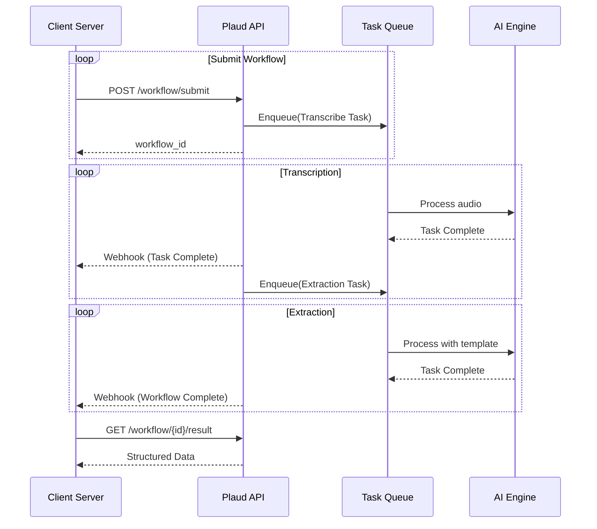

This guide shows how to build end-to-end workflows that automatically transcribe audio files and extract structured information using AI, with full customization through templates.

## Flow Chart

Plaud AI Workflows enable you to chain multiple AI tasks together. 
The most common pattern combines **audio transcription** with **data extraction** to transform unstructured audio into structured, actionable data.

<Frame>
  
</Frame>

The diagram above illustrates the high-level workflow, which can be broken down into the following key stages:

1.  **Transcription**: An audio file is processed and converted into a text transcript.
2.  **Template Application**: The AI Engine applies the custom **Workflow Template** containing the rules for data extraction.
3.  **Extraction & Output**: The engine processes the transcript according to the template's rules to produce structured data.
## Quick Start

### Technical Flow



1. **Asynchronous Processing**: Workflow returns immediately with `workflow_id`, tasks execute in background
2. **Chain Execution**: Subsequent task only starts after previous task completes  
3. **Webhook Notifications**: Real-time status updates sent to your configured webhook endpoints
4. **Template Integration**: Custom template automatically loaded and applied during extraction processing
5. **Result Storage**: All outputs (transcripts, extracted data) stored in secure cloud storage

### Prerequisites

<CardGroup cols={2}>
  <Card title="1. API Token" icon="key" href="/api_guide/api_intro/authorization">
    Obtain your authentication credentials to securely access the API.
  </Card>
  <Card title="2. Bind Device to User" icon="mobile-notch" href="/documentation/developer_guides/tutorials/device_operations">
    Associate a device with a user account to enable file uploads.
  </Card>
  <Card title="3. Upload Audio Recording" icon="upload" href="/documentation/developer_guides/tutorials/files">
    Upload your audio files to our platform for processing.
  </Card>
  <Card title="4. Create Custom Template" icon="pen-to-square">
    Design a template to define your data extraction rules. *(Coming Soon)*
  </Card>
</CardGroup>

### Walkthrough

#### Step 1: Submit AI Workflow

First, submit a workflow that combines audio transcription with a pre-existing custom ETL template.

<CodeGroup>
```python Python
import requests

# Configuration
PLAUD_API_TOKEN = "<your_api_token_here>"
BASE_URL = "https://api.plaud.ai/api"
headers = {
    "Authorization": f"Bearer {PLAUD_API_TOKEN}",
    "Content-Type": "application/json"
}

# Define workflow payload
workflow_data = {
  "workflows": [
    {
      "task_type": "AUDIO_TRANSCRIBE",
      "task_params": { "file_id": "audio_file_123" }
    },
    {
      "task_type": "AI_ETL", 
      "task_params": { "template_id": "tpl_your_template_id" }
    }
  ]
}

# Submit the workflow
response = requests.post(
    f"{BASE_URL}/workflow/submit",
    headers=headers,
    json=workflow_data
)

workflow_id = response.json()["id"]
print(f"Workflow submitted with ID: {workflow_id}")
```

```bash cURL
curl -X POST "https://api.plaud.ai/api/workflow/submit" \
  -H "Authorization: Bearer <your_api_token_here>" \
  -H "Content-Type: application/json" \
  -d '{
    "workflows": [
      {
        "task_type": "AUDIO_TRANSCRIBE",
        "task_params": { "file_id": "audio_file_123" }
      },
      {
        "task_type": "AI_ETL",
        "task_params": { "template_id": "tpl_your_template_id" }
      }
    ]
  }'
```
</CodeGroup>

#### Step 2: Monitor Workflow Progress

You can check the status of your workflow by polling the status endpoint.

<CodeGroup>
```python Python
import requests

# Configuration
PLAUD_API_TOKEN = "<your_api_token_here>"
BASE_URL = "https://api.plaud.ai/api"
headers = { "Authorization": f"Bearer {PLAUD_API_TOKEN}" }

# Assumes workflow_id is available from the previous step
response = requests.get(
    f"{BASE_URL}/workflow/{workflow_id}/status",
    headers=headers
)

status_info = response.json()
print(f"Status: {status_info['status']}")
print(f"Progress: {status_info['completed_tasks']}/{status_info['total_tasks']}")
```
```bash cURL
curl -X GET "https://api.plaud.ai/api/workflow/{workflow_id}/status" \
  -H "Authorization: Bearer <your_api_token_here>"
```
</CodeGroup>

<Tip title="Polling vs. Webhooks">
  While polling is useful for quick checks, we strongly recommend using **Webhooks** for production applications. Webhooks provide real-time status updates to your server without the need for continuous polling.

  [Learn more about configuring webhooks →](/documentation/developer_guides/webhook_events)
</Tip>

#### Step 3: Retrieve Structured Results

Once the workflow status is `SUCCESS`, you can fetch the final results.

<CodeGroup>
```python Python
import requests
import json

# Configuration
PLAUD_API_TOKEN = "<your_api_token_here>"
BASE_URL = "https://api.plaud.ai/api"
headers = { "Authorization": f"Bearer {PLAUD_API_TOKEN}" }

# Assumes workflow_id is available
response = requests.get(
    f"{BASE_URL}/workflow/{workflow_id}/result",
    headers=headers
)

if response.status_code == 200:
    results = response.json()
    print("✅ Workflow results retrieved:")
    print(json.dumps(results, indent=2))
```
```bash cURL
curl -X GET "https://api.plaud.ai/api/workflow/{workflow_id}/result" \
  -H "Authorization: Bearer <your_api_token_here>"
```
</CodeGroup>

#### Step 4: Complete Example

Here's a complete Python script that handles the entire workflow:

```python complete_workflow_example.py
import requests
import time
import json
from typing import Optional, Dict, Any

class PlaudWorkflowClient:
    """Complete client for Plaud AI Workflow operations."""
    
    def __init__(self, api_token: str, client_id: str, base_url: str = "https://api.plaud.ai/api"):
        self.api_token = api_token
        self.client_id = client_id
        self.base_url = base_url
        self.headers = {
            "Authorization": f"Bearer {api_token}",
            "X-Identity-Provider": "cognito", 
            "Content-Type": "application/json"
        }
    
    def submit_workflow(self, file_id: str, template_id: str, 
                       workflow_name: str = "ai_workflow") -> Optional[str]:
        """Submit AI workflow and return workflow_id."""
        print(f"Submitting workflow for file: {file_id}")
        
        workflow_data = {
            "workflows": [
                {
                    "task_type": "AUDIO_TRANSCRIBE",
                    "task_params": {
                        "file_id": file_id,
                        "language": "zh",
                        "diarization": True
                    }
                },
                {
                    "task_type": "AI_ETL",
                    "task_params": {
                        "template_id": template_id,
                        "language": "zh",
                        "model": "openai"
                    }
                }
            ],
            "metadata": {"workflow_name": workflow_name},
            "version": "1.0"
        }
        
        response = requests.post(
            f"{self.base_url}/workflow/submit",
            headers=self.headers,
            json=workflow_data
        )
        
        if response.status_code == 200:
            workflow_info = response.json()
            print(f"✅ Workflow submitted: {workflow_info['id']}")
            return workflow_info["id"]
        else:
            print(f"❌ Workflow submission failed: {response.status_code}")
            print(response.text)
            return None
    
    def monitor_workflow(self, workflow_id: str, max_wait_time: int = 600) -> bool:
        """Monitor workflow until completion."""
        print(f"Monitoring workflow: {workflow_id}")
        start_time = time.time()
        
        while time.time() - start_time < max_wait_time:
            response = requests.get(
                f"{self.base_url}/workflow/{workflow_id}/status",
                headers=self.headers
            )
            
            if response.status_code == 200:
                status_info = response.json()
                status = status_info["status"]
                progress = f"{status_info['completed_tasks']}/{status_info['total_tasks']}"
                
                print(f"Status: {status} | Progress: {progress}")
                
                if status == "SUCCESS":
                    print("✅ Workflow completed successfully!")
                    return True
                elif status == "FAILURE":
                    print("❌ Workflow failed!")
                    return False
                
                time.sleep(10)
            else:
                print(f"Status check failed: {response.status_code}")
                time.sleep(5)
        
        print("⏰ Monitoring timed out")
        return False
    
    def get_results(self, workflow_id: str) -> Optional[Dict]:
        """Get workflow results."""
        print(f"Retrieving results for workflow: {workflow_id}")
        
        response = requests.get(
            f"{self.base_url}/workflow/{workflow_id}/result",
            headers=self.headers
        )
        
        if response.status_code == 200:
            results = response.json()
            print("✅ Results retrieved successfully!")
            return results
        else:
            print(f"❌ Failed to get results: {response.status_code}")
            return None

def main():
    """Complete workflow example."""
    # Configuration
    API_TOKEN = "<your_api_token_here>"
    CLIENT_ID = "client_abc123"
    FILE_ID = "audio_file_123"      # Your uploaded audio file
    TEMPLATE_ID = "tpl_your_template_id" # Your pre-existing template ID
    
    # Initialize client
    client = PlaudWorkflowClient(API_TOKEN, CLIENT_ID)
    
    # Step 1: Submit workflow
    workflow_id = client.submit_workflow(FILE_ID, TEMPLATE_ID, "medical_analysis")
    if not workflow_id:
        return
    
    # Step 2: Monitor progress
    success = client.monitor_workflow(workflow_id)
    if not success:
        return
    
    # Step 3: Get results
    results = client.get_results(workflow_id)
    if results:
        # Display final extracted data
        etl_task = next((task for task in results['tasks'] if task['task_type'] == 'AI_ETL'), None)
        if etl_task and etl_task['result']:
            print("\n=== Extracted Structured Data ===")
            print(json.dumps(etl_task['result'], indent=2, ensure_ascii=False))

if __name__ == "__main__":
    main()
```

Run the complete example:

```bash
# Install dependencies
pip install requests

# Run the script
python complete_workflow_example.py
```

## Common Error Scenarios

| Error Code | HTTP Status | Cause | Solution |
|:-----------|:------------|:------|:---------|
| **WORKFLOW_PARAMS_INVALID** | 400 | Missing required parameters or invalid task configuration | Verify `file_id`, `template_id`, and task parameters |
| **FILE_NOT_FOUND** | 404 | Audio file doesn't exist or not accessible | Ensure file is uploaded and belongs to correct user |
| **TEMPLATE_NOT_FOUND** | 404 | Invalid `template_id` provided | Verify template exists and belongs to your client |
| **INSUFFICIENT_CREDITS** | 402 | Account lacks credits for AI processing | Top up your account credits |
| **TASK_PROCESSING_FAILED** | 500 | AI processing encountered an error | Check audio quality, try again, or contact support |

## Explore More

<CardGroup cols={1}>
  <Card title="Webhook Events" icon="webhook" href="/documentation/developer_guides/webhook_events">
    Receive real-time notifications for workflow and task status updates.
  </Card>
</CardGroup>