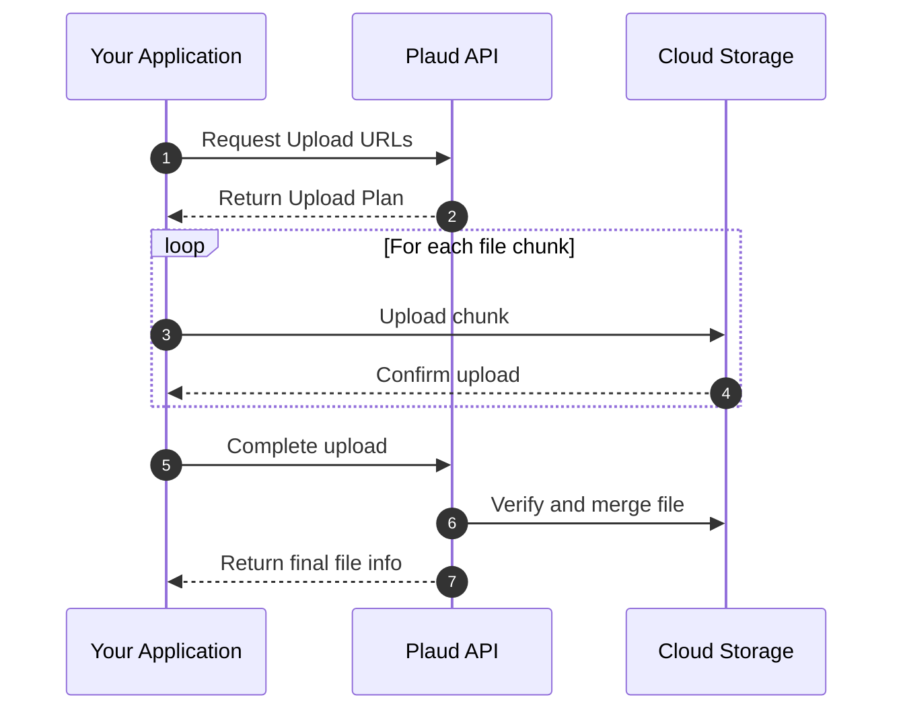

This guide will show you how to upload recording files using the secure multipart upload process. 
The upload flow ensures file integrity and supports large file uploads with resumable capabilities.

## Flow Chart

The multipart upload process consists of three main steps:

1. **Generate pre-signed URLs** - Request secure upload URLs from the Plaud API
2. **Upload file chunks** - Upload each file chunk directly to cloud storage  
3. **Complete upload with verification** - Notify the API and verify file integrity



## Walkthrough

<Steps>
<Step title="Step 1: Create an API Token">
First, create an API token using your [client credentials](/api_guide/api_intro/authorization) to securely access the API. All subsequent requests will need this token.
```
PLAUD_API_TOKEN = <your_api_token_here>
```
</Step>

<Step title="Step 2: Bind a Device to a User">
A recording's ownership is inherited from the user account that owns the device. Therefore, you must bind a device to a user before uploading any recordings from it.

<Card 
    title="Learn how to bind a device" 
    href="/documentation/developer_guides/tutorials/device_operations"
    icon="mobile-signal"
>
    If your device haven't been bound with a user account yet, please follow this guide first.
</Card>
</Step>

<Step title="Step 3: Generate Upload URLs">

Before uploading a recording, call [this API](/api-reference/file/generate-presigned-urls) to prepare for chunked upload. 
The API will automatically calculate how to split your file into chunks and generate a unique upload plan. 
You'll receive a `file_id`, an `upload_id`, and a list of secure pre-signed URLs - one for each chunk that needs to be uploaded.

<CodeGroup>
```python Python
import requests
import os

PLAUD_API_TOKEN = "<your_api_token_here>"
BASE_URL = "https://api.plaud.ai/api"
headers = {
    "Authorization": f"Bearer {PLAUD_API_TOKEN}",
    "Content-Type": "application/json"
}

# Get file info
file_path = "./recording.opus"
file_size = os.path.getsize(file_path)
file_type = "opus" if file_path.endswith(".opus") else "mp3"

# Generate pre-signed URLs
response = requests.post(
    f"{BASE_URL}/files/upload-s3/generate-presigned-urls",
    headers=headers,
    json={
        "filesize": file_size,
        "filetype": file_type
    }
)

upload_info = response.json()
file_id = upload_info["FileId"]
upload_id = upload_info["UploadId"]
parts = upload_info["Parts"]
```

```bash cURL
curl -X POST "https://api.plaud.ai/api/files/upload-s3/generate-presigned-urls" \
  -H "Authorization: Bearer <your_api_token>" \
  -H "Content-Type: application/json" \
  -d '{
    "filesize": 1048576,
    "filetype": "opus"
  }'
```
</CodeGroup>
</Step>

<Step title="Step 4: Upload File Chunks">
Using the pre-signed URLs from the previous step, upload each file chunk directly to secure cloud storage. For each successful chunk upload, the storage service will return an `ETag` header (a "digital receipt" for that chunk). You must collect all of these ETags.

<CodeGroup>
```python Python
import hashlib

# Upload file chunks to cloud storage
part_list = []
chunk_size = upload_info["ChunkSize"]

with open(file_path, 'rb') as f:
    for part in parts:
        chunk = f.read(chunk_size)
        
        # Upload chunk to cloud storage
        upload_response = requests.put(
            part["PresignedUrl"],
            data=chunk,
            headers={"Content-Type": "application/octet-stream"}
        )
        
        # Store ETag for completion
        etag = upload_response.headers["ETag"].strip('"')
        part_list.append({
            "PartNumber": part["PartNumber"],
            "ETag": etag
        })

# Calculate file MD5 for integrity verification
with open(file_path, 'rb') as f:
    file_md5 = hashlib.md5(f.read()).hexdigest()
```

```curl cURL
# This is a conceptual example for a single chunk.
# You will receive a unique pre-signed URL for each part from the previous step.
curl -X PUT "<presigned_url_for_part_1>" \
  -H "Content-Type: application/octet-stream" \
  --data-binary "@path/to/your/file_chunk_1.opus"
```
</CodeGroup>

<Warning>
**Note for cURL users:** The cURL example above shows the structure for uploading a single chunk. The complete multipart upload flow requires uploading multiple chunks in a loop, which is better handled programmatically.
</Warning>
</Step>

<Step title="Step 5: Complete the Upload">
After all chunks are uploaded, make one final call to the Plaud API. Provide the `file_id`, the `upload_id`, and the list of "receipts" (`part_list`) you collected. The API then verifies that all parts are present and assembles them into the final file.

<CodeGroup>
```python Python
# Complete the upload
complete_response = requests.post(
    f"{BASE_URL}/files/upload-s3/complete-upload",
    headers=headers,
    json={
        "owner_id": "user_12345",
        "file_id": file_id,
        "upload_id": upload_id,
        "part_list": part_list,
        "filetype": file_type,
        "file_md5": file_md5,
        "name": os.path.basename(file_path)
    }
)

file_info = complete_response.json()
print(f"Upload completed! File ID: {file_info.get('id')}")
```

```curl cURL
curl -X POST "https://api.plaud.ai/api/files/upload-s3/complete-upload" \
  -H "Authorization: Bearer <your_api_token>" \
  -H "Content-Type": application/json" \
  -d '{
    "owner_id": "user_12345",
    "file_id": "your_file_id",
    "upload_id": "your_upload_id",
    "part_list": [{
      "PartNumber": 1,
      "ETag": "your_etag_for_part_1"
    }],
    "filetype": "opus",
    "file_md5": "your_file_md5_hash",
    "name": "my-first-recording.opus"
  }'
```
</CodeGroup>
</Step>

<Step title="Step 6: Execute the Full Script">
The following is a complete Python script that handles the entire upload workflow. Create a file named `upload_example.py`, paste the code below, and modify the placeholder variables.

<CodeGroup>
```python upload_example.py
import requests
import os
import hashlib
from tqdm import tqdm

# --- 1. Configuration ---
# Replace with your actual values
PLAUD_API_TOKEN = "<your_api_token_here>"
FILE_PATH = "./recording.opus"  # Make sure you have a sample file here
OWNER_ID = "user_12345" # The user this recording belongs to
DEVICE_SN = "NP20240001" # Optional: The device that generated the recording

# API Configuration
BASE_URL = "https://api.plaud.ai/api"
HEADERS = {
    "Authorization": f"Bearer {PLAUD_API_TOKEN}",
    "Content-Type": "application/json"
}

# --- 2. Helper Functions ---
def generate_presigned_urls(file_path):
    """Gets the secure URLs and IDs needed to upload chunks."""
    print("Step 1: Generating pre-signed URLs...")
    file_size = os.path.getsize(file_path)
    file_type = "opus" if file_path.endswith(".opus") else "mp3"
    
    response = requests.post(
        f"{BASE_URL}/files/upload-s3/generate-presigned-urls",
        headers=HEADERS,
        json={"filesize": file_size, "filetype": file_type}
    )
    response.raise_for_status()
    print("✅ Successfully generated URLs.")
    return response.json()

def upload_chunks(file_path, upload_info):
    """Uploads file chunks to S3 and returns the ETag list."""
    print("\nStep 2: Uploading file chunks to cloud storage...")
    part_list = []
    chunk_size = upload_info["ChunkSize"]
    parts = upload_info["Parts"]

    with open(file_path, 'rb') as f, tqdm(total=len(parts), unit="chunk", desc="Uploading") as pbar:
        for part in parts:
            chunk = f.read(chunk_size)
            if not chunk:
                break
            
            upload_response = requests.put(
                part["PresignedUrl"],
                data=chunk,
                headers={"Content-Type": "application/octet-stream"}
            )
            upload_response.raise_for_status()
            
            etag = upload_response.headers["ETag"].strip('"')
            part_list.append({"PartNumber": part["PartNumber"], "ETag": etag})
            pbar.update(1)
            
    print("✅ All chunks uploaded successfully.")
    return part_list

def complete_upload(file_path, upload_info, part_list):
    """Sends the final confirmation to the API to finalize the file."""
    print("\nStep 3: Completing the upload...")
    with open(file_path, 'rb') as f:
        file_md5 = hashlib.md5(f.read()).hexdigest()
        
    payload = {
        "owner_id": OWNER_ID,
        "sn": DEVICE_SN,
        "file_id": upload_info["FileId"],
        "upload_id": upload_info["UploadId"],
        "part_list": part_list,
        "filetype": "opus" if file_path.endswith(".opus") else "mp3",
        "file_md5": file_md5,
        "name": os.path.basename(file_path)
    }
    
    complete_response = requests.post(
        f"{BASE_URL}/files/upload-s3/complete-upload",
        headers=HEADERS,
        json=payload
    )
    complete_response.raise_for_status()
    print("✅ Upload complete and file is now being processed.")
    return complete_response.json()

# --- 3. Main Execution ---
if __name__ == "__main__":
    if not os.path.exists(FILE_PATH):
        print(f"Error: File not found at '{FILE_PATH}'. Please create a sample recording file.")
    else:
        try:
            # Step 1
            upload_details = generate_presigned_urls(FILE_PATH)
            
            # Step 2
            final_part_list = upload_chunks(FILE_PATH, upload_details)
            
            # Step 3
            final_file_info = complete_upload(FILE_PATH, upload_details, final_part_list)
            
            print("\n--- Success! ---")
            print(f"File ID: {final_file_info.get('id')}")
            print(f"File Name: {final_file_info.get('name')}")
            print(f"Status: {final_file_info.get('status')}")
            print("You will receive a webhook notification once processing is complete.")

        except requests.exceptions.HTTPError as e:
            print(f"\n--- An HTTP error occurred ---")
            print(f"Status Code: {e.response.status_code}")
            print(f"Response: {e.response.text}")
        except Exception as e:
            print(f"\n--- An unexpected error occurred ---")
            print(str(e))

```
</CodeGroup>

<Info>
You will need to install the `requests` and `tqdm` packages to run this script:
`pip install requests tqdm`
</Info>

Now, run the script from your terminal:
<CodeGroup>
    ```python Python
    python upload_example.py
    ```
</CodeGroup>

You should see the upload progress and the final file information.
</Step>

</Steps>

## Common Error Scenarios

| Error Code | Cause |
|:-----------|:------|
| **FILE_UPLOAD_FAILED** | S3 upload failed or network error, returns `400` |
| **FILE_MD5_NOT_MATCH** | File integrity check failed, returns `400` |
| **DEVICE_NOT_BOUND** | Device not bound to user when using sn, returns `400` |

## Explore more
<Card
    title="Webhook Notifications"
    icon="webhook"
    href="/documentation/developer_guides/tutorials/files/webhooks"
  >
    Get real-time notifications on files event via webhooks.
</Card>

## Next Steps

Explore the [File Upload API](/api-reference/file/generate-presigned-urls) to learn more details.
