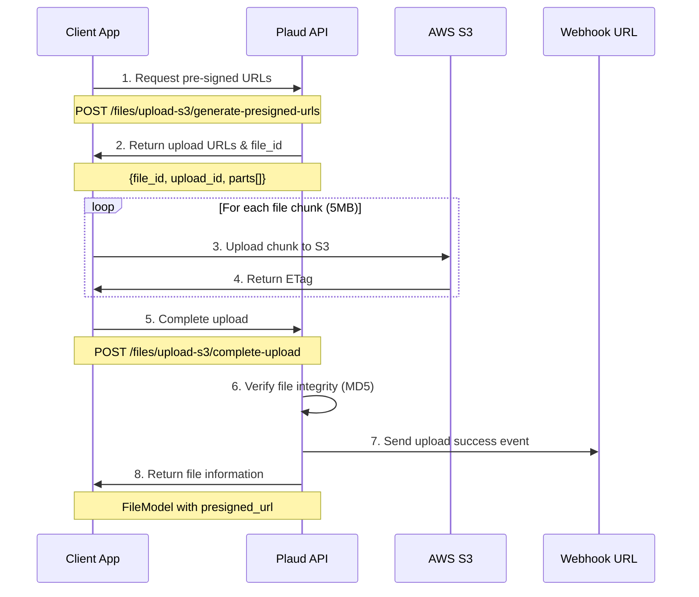

This guide will show you how to upload recording files using the secure multipart upload process. 
The upload flow ensures file integrity and supports large file uploads with resumable capabilities.

## Upload Flow Overview

The multipart upload process consists of three main steps: generating pre-signed URLs, uploading file chunks, and completing the upload with file verification.



## Upload a file

<Steps>

<Step title="Create an API Token">

Create an API token using your [client credentials](/api-guide/api-intro/authorization), which you'll use to securely access the API.

```
PLAUD_API_TOKEN = <your_api_token_here>
```

</Step>

<Step title="Get Upload URLs">

Request pre-signed URLs from the Plaud API for secure file upload:

<CodeGroup>

```python Python
import requests
import os

BASE_URL = "https://platform.plaud.cn/api"
headers = {
    "Authorization": f"Bearer {PLAUD_API_TOKEN}",
    "Content-Type": "application/json"
}

# Get file info
file_path = "./recording.opus"
file_size = os.path.getsize(file_path)
file_type = "opus" if file_path.endswith(".opus") else "mp3"

# Generate pre-signed URLs
response = requests.post(
    f"{BASE_URL}/files/upload-s3/generate-presigned-urls",
    headers=headers,
    json={
        "filesize": file_size,
        "filetype": file_type
    }
)

upload_info = response.json()
file_id = upload_info["FileId"]
upload_id = upload_info["UploadId"]
parts = upload_info["Parts"]
```

```curl cURL
curl -X POST "https://platform.plaud.cn/api/files/upload-s3/generate-presigned-urls" \
  -H "Authorization: Bearer $PLAUD_API_TOKEN" \
  -H "Content-Type: application/json" \
  -d '{
    "filesize": 1048576,
    "filetype": "opus"
  }'
```

</CodeGroup>

Now you have the upload URLs and file ID. Use these to upload your file chunks to S3.

</Step>

<Step title="Upload to S3">

Upload file chunks to S3 using the pre-signed URLs:

<CodeGroup>

```python Python
import hashlib

# Upload file chunks to S3
part_list = []
chunk_size = upload_info["ChunkSize"]

with open(file_path, 'rb') as f:
    for part in parts:
        chunk = f.read(chunk_size)
        
        # Upload chunk to S3
        upload_response = requests.put(
            part["PresignedUrl"],
            data=chunk,
            headers={"Content-Type": "application/octet-stream"}
        )
        
        # Store ETag for completion
        etag = upload_response.headers["ETag"].strip('"')
        part_list.append({
            "PartNumber": part["PartNumber"],
            "ETag": etag
        })

# Calculate file MD5 for integrity verification
with open(file_path, 'rb') as f:
    file_md5 = hashlib.md5(f.read()).hexdigest()
```

```curl cURL
# Upload file to S3
curl -X PUT "$PRESIGNED_URL" \
  -H "Content-Type: application/octet-stream" \
  --data-binary "@recording.opus"
```

</CodeGroup>

All file chunks are now uploaded to S3. Complete the upload process to register the file in the system.

</Step>

<Step title="Complete Upload">

Complete the upload process and register the file:

<CodeGroup>

```python Python
# Complete the upload
complete_response = requests.post(
    f"{BASE_URL}/files/upload-s3/complete-upload",
    headers=headers,
    json={
        "sn_type": "notepin",
        "owner_id": "user_12345",
        "file_id": file_id,
        "upload_id": upload_id,
        "part_list": part_list,
        "filetype": file_type,
        "file_md5": file_md5,
        "name": os.path.basename(file_path)
    }
)

file_info = complete_response.json()
```

```curl cURL
curl -X POST "https://platform.plaud.cn/api/files/upload-s3/complete-upload" \
  -H "Authorization: Bearer $PLAUD_API_TOKEN" \
  -H "Content-Type: application/json" \
  -d '{
    "sn_type": "notepin",
    "owner_id": "user_12345",
    "file_id": "your_file_id",
    "upload_id": "your_upload_id",
    "part_list": [{
      "PartNumber": 1,
      "ETag": "your_etag"
    }],
    "filetype": "opus",
    "name": "recording.opus"
  }'
```

</CodeGroup>

Your file is now successfully uploaded and registered in the system. You can use the returned `file_info` for further processing.

</Step>

<Step title="Execute the Code">

<CodeGroup>
    ```python Python
    python upload_example.py
    ```
</CodeGroup>

You should see upload progress and the final file information with download URL.

</Step>

</Steps>

## Upload Parameters

| Parameter | Type | Required | Description |
|:----------|:-----|:---------|:------------|
| **filesize** | `integer` | Yes | File size in bytes |
| **filetype** | `string` | Yes | File format: "opus" or "mp3" |
| **sn_type** | `string` | No | Device type: "notepin", "note", "notepro" |
| **sn** | `string` | Conditional | Device serial number (required if no owner_id) |
| **owner_id** | `string` | Conditional | User ID (required if no sn) |
| **file_md5** | `string` | Recommended | MD5 hash for integrity verification |
| **name** | `string` | No | Display name for the file |

## Webhook Notifications

The platform sends webhook notifications when file uploads complete. Learn more about setting up and handling webhooks in our [Webhooks guide](/documentation/developer_guides/files/webhooks).

## Common Error Scenarios

| Error Code | Cause |
|:-----------|:------|
| **FILE_UPLOAD_FAILED** | S3 upload failed or network error, returns `400` |
| **FILE_MD5_NOT_MATCH** | File integrity check failed, returns `400` |
| **DEVICE_NOT_BOUND** | Device not bound to user when using sn, returns `400` |